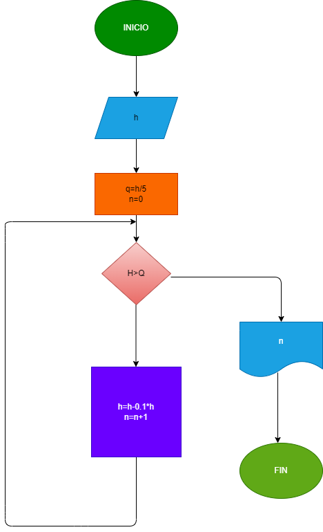

### Una pelota se deja caer de una altura H, y en cada rebote sube el 10% menos del anterior. 
### hacer el diagrama de flujo y el programa en python, que lea h, y que calcule e imprima en 
### cual rebote la pelota no alcanza a subir la 5 parte de la altura inicial.
## DIAGRAMA DE FLUJO
